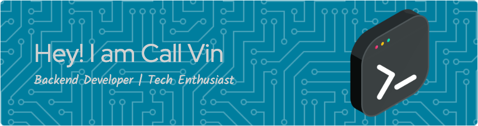

<h1 align="center">

</h1>

 

- 💻 I am Backend Developer
- 🌱 I’m currently Work at Telecommunication Company
- 📫 How to reach me: [kanggara.my.id](https://kanggara.my.id)
- 📊 See My Stats on [CodersRank](https://profile.codersrank.io/user/kanggara)
- 🕵️‍♂️ You can almost find me anywhere on internet by `KAnggara75` as a username.

<h1 align="center"> Connect with me

 

 

 

 

 

</h1>

### 🧑🏻‍💻 Languages

### 🚀 Frameworks & Library

### ⚡ Database

### 🧰 Tools & IDE

### 💻 My OS 📱

## Repo Stats

## WakaTime

  

###

  
  
  

###

  

###

<h1 align="center">hey there 👋</h1>

###

<h3 align="left">👩‍💻  About Me</h3>

###

I'm ... from ....  - 🔭 I’m working as ... - 📚 I'm currently learning ... - ⚡ In my free time I ...

###

<h3 align="left">🛠 Language and tools</h3>

###

  
  
  
  
  
  
  
  
  
  
  
  
  
  
  
  
  

###

<h3 align="left">🔥   My Stats :</h3>

###

  

###

Hello World!!

###

<picture>
  <source media="(prefers-color-scheme: dark)" srcset="https://raw.githubusercontent.com/KAnggara75/KAnggara75/output/pacman-contribution-graph-dark.svg">
  <source media="(prefers-color-scheme: light)" srcset="https://raw.githubusercontent.com/KAnggara75/KAnggara75/output/pacman-contribution-graph.svg">
  
</picture>

###

  

###

  

###

  
  
  
  

###

  
  

###

 

  

###

  
  
  
  
  
  
  
  
  

###

###

  

###
