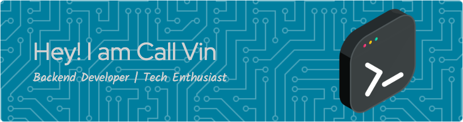

  

  
  
  
  

---

### 👨‍💻 About Me

- 💻 **Backend Developer** specializing in distributed systems, event-driven architectures, and high-throughput enterprise backend services.
- 💼 **Current Focus**: Modernizing mission-critical financial & insurance backend systems at **IFG Life** using **Java (Spring Boot, Quarkus)** and **Golang**.
- ⚙️ **Event-Driven & Messaging**: Architecting robust asynchronous message processing with **Apache Kafka** (DLQ, retry policies, consumer idempotency) and **Solace**.
- ☁️ **Cloud & DevOps**: Container orchestration with **Docker**, **Kubernetes**, Helm, and GitOps workflows via **ArgoCD**.
- 🌐 **Personal Website & Blog**: [kanggara.my.id](https://kanggara.my.id)
- 📍 **Location**: Tangerang Selatan, Banten, Indonesia

---

### 🛠 Tech Stack

#### 🧑🏻‍💻 Languages

#### 🚀 Backend, Frameworks & Architecture

#### ☁️ Cloud, DevOps & Infrastructure

#### ⚡ Database & Caching

---

### 📊 GitHub Stats & Metrics

  
  
    
  
  

#### 📌 Highlighted Repositories

  
  

---

### 🎮 Contribution Arcade

  <b>🐍 Snake Contribution Game</b> 
  

  <b>👻 Pac-Man Contribution Game</b> 
  

---

### ⏱ Coding Activity (WakaTime)

  

---

### 🌐 Connect with Me

  
  
  
  
  
  

  

